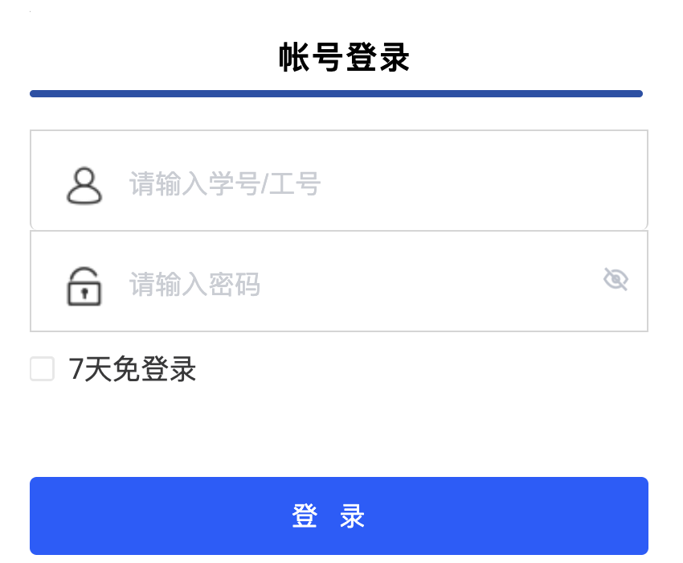
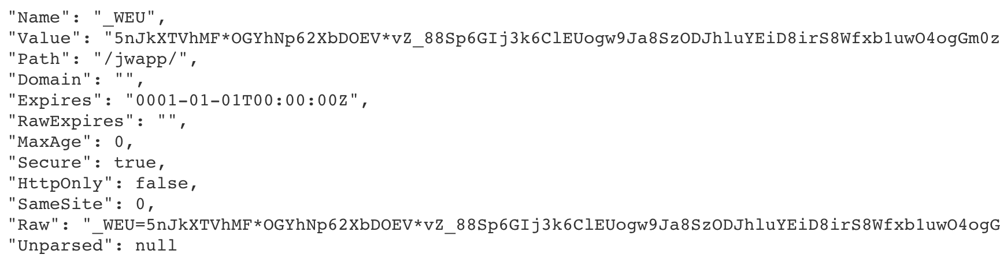

# 金智教务网登录程序
> 北京信息科技大学版本，理论上适用于所有**金智教务端**，为课表/成绩查询、校内论坛、校园卡余额查询等应用提供支撑。



# 声明

1. 本项目仅供学习交流使用，如作他用所承受的任何直接、间接法律责任一概与作者无关
2. 如果此项目侵犯了您或者您公司的权益，请联系作者删除
3. 请使用 Golang 1.20 及以上版本

# 已实现的功能

- [x] 教务网自动登录，返回 Cookie
- [x] 验证码自动识别
- [x] 失败重试机制（最多3次）
- [ ] …

# 如何使用？

本项目使用 Go 语言编写，使用 `tesseract` 实现了验证码自动识别的功能。

如果需要运行程序，首先需要安装 `tesseract`，不同的机型安装方式如下：

```shell
# Mac
brew install tesseract leptonica

# CentOS
sudo yum install tesseract leptonica-devel

# Ubuntu 或 Debian
sudo apt update
sudo apt install tesseract-ocr
sudo apt install libtesseract-dev
```

在 Windows 上，你可以从这里下载预编译的二进制文件：[Tesseract at UB Mannheim](https://github.com/tesseract-ocr/tesseract/wiki/4.0-with-LSTM#400-alpha-for-windows)。

直接运行程序，程序默认对外暴露 `9999` 端口，GET 请求 `/login` 路径+账号密码，服务器返回 Cookie：

```shell
curl http://127.0.0.1:9999/login?username=账号&password=密码
```



# 项目结构

```shell
├── entity	# 实体对象
├── main.go	# 主程序
└── utils	# 工具
    ├── captureutil	# 验证码识别模块
    ├── encryutil	# 加密/解密模块
    ├── httputil	# 网络请求模块
    ├── loginutil	# 登录模块
    └── randString.go	# 随机字符串生成工具
```

# Tips

**如果你是 Mac 系统**，在运行程序的时候可能会报错：

```shell
tessbridge.cpp:5:10: fatal error: 'leptonica/allheaders.h' file not found #286
```

这是 gosseract 现有版本（v2.4.1）存在的一个问题，具体解决方式见：[解决方式](https://github.com/otiai10/gosseract/issues/234#issuecomment-1248991263)

**如果你想将运行在 CentOS 服务器**，建议将程序拷贝至服务器，在服务器上进行编译：

```go
go build
```

如果在编译过程中报错：`cannot find -lleptonica`，则是因为 leptonica 的版本问题，执行下面语句后重新编译即可：

```go
cp /usr/lib64/liblept.so /usr/lib64/libleptonica.so
```


